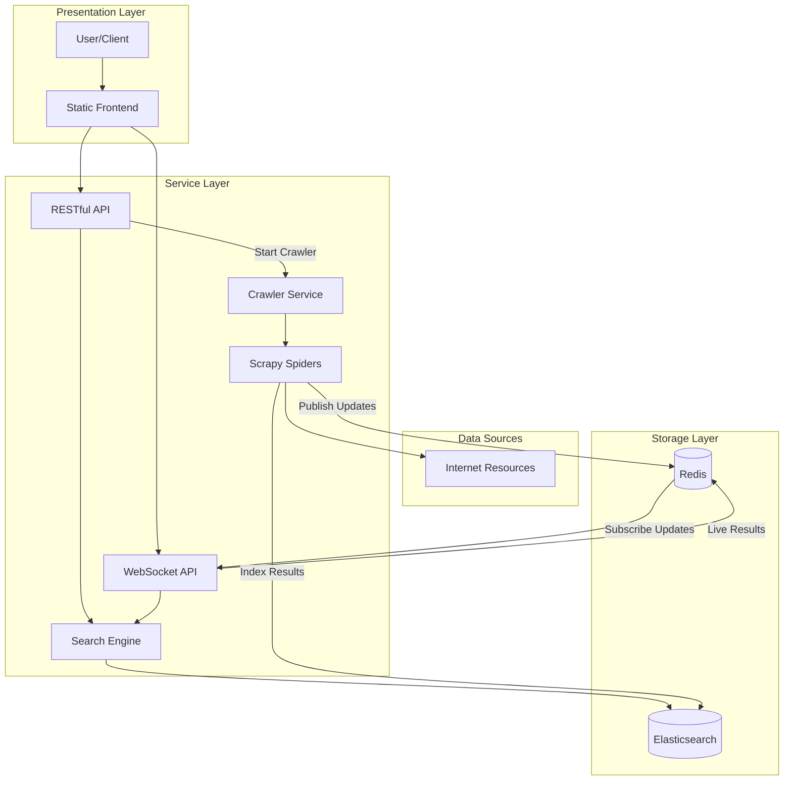

# Resource Grep Architecture

This document describes the architecture of Resource Grep, a real-time search engine for programming resources.

## System Overview

Resource Grep is designed as a distributed system composed of several microservices that work together to provide real-time search capabilities. The system follows an event-driven architecture to enable asynchronous processing, scalability, and real-time updates.



## Core Components

### 1. Web Interface

- **Technology**: HTML/CSS/JavaScript (vanilla)
- **Purpose**: Provides the user interface for searching resources
- **Features**:
  - Instant search with real-time updates
  - Resource filtering and sorting
  - WebSocket-based real-time results
  - Fallback to HTTP search when WebSocket is unavailable
  - Resource display with syntax highlighting for code snippets

### 2. API Gateway

- **Technology**: FastAPI (Python)
- **Purpose**: Serves as the entry point for all client requests
- **Features**:
  - RESTful API for search queries
  - WebSocket support for real-time search results
  - Request validation and authentication
  - Rate limiting
  - Response caching for popular queries
  - Load balancing across search nodes

### 3. Search Service

- **Technology**: Elasticsearch + Python
- **Purpose**: Provides search functionality across indexed resources
- **Features**:
  - Full-text search with highlighting
  - Faceted search (by language, resource type, etc.)
  - Relevance scoring based on content quality and popularity
  - Language-specific tokenization for code search
  - Query expansion for programming terminology

### 4. Resource Crawler

- **Technology**: Scrapy (Python)
- **Purpose**: Discovers and extracts programming resources from the web
- **Features**:
  - Depth-first crawling of programming websites
  - Search engine integration for seed URLs
  - Resource extraction with heuristic detection
  - Content extraction including code snippets
  - Language and framework detection
  - Quality scoring for discovered resources
  - Respects robots.txt by default, with override options
  - Enhanced support for legacy programming languages (COBOL, FORTRAN, etc.)

### 5. Resource Processor

- **Technology**: Python
- **Purpose**: Processes and enriches crawled resources
- **Features**:
  - Content cleaning and normalization
  - Resource type classification (tutorial, documentation, article, etc.)
  - Code snippet extraction and language detection
  - Quality scoring based on multiple heuristics
  - Duplicate detection
  - Metadata extraction (authors, timestamps, frameworks, etc.)

### 6. Indexing Service

- **Technology**: Python + Elasticsearch client
- **Purpose**: Indexes processed resources into the search engine
- **Features**:
  - Custom mappings for code-specific search
  - Bulk indexing for efficiency
  - Language-specific analyzers
  - Versioned indexing to support schema evolution
  - Near real-time indexing for fresh results

### 7. Job Queue

- **Technology**: Redis
- **Purpose**: Manages crawl jobs and message passing between services
- **Features**:
  - Priority-based crawl job scheduling
  - Distributed message passing
  - Pub/Sub for real-time updates
  - Job status tracking

### 8. Streaming Service

- **Technology**: FastAPI (Python) + WebSockets
- **Purpose**: Provides real-time search results via WebSockets
- **Features**:
  - Search result streaming
  - Status updates
  - Multi-client broadcasting
  - Connection management

## Data Flow

1. **Search Flow**:
   - User enters a search query in the web interface
   - Query is sent to the API Gateway via HTTP or WebSocket
   - API Gateway forwards the query to the Search Service
   - Search Service queries Elasticsearch for matching resources
   - If few results are found, a new crawl job is initiated
   - Results are returned to the user via HTTP or streamed via WebSocket
   - New resources are streamed to the user as they're discovered and indexed

2. **Crawling Flow**:
   - Crawl job is created by the API Gateway or Search Service
   - Job Queue schedules the job based on priority
   - Resource Crawler picks up the job and begins crawling
   - Discovered URLs are sent back to Job Queue for further crawling
   - Extracted resources are sent to the Resource Processor
   - Resource Processor enriches and validates the resources
   - Processed resources are sent to the Indexing Service
   - Indexing Service indexes the resources in Elasticsearch
   - Streaming Service is notified of new resources
   - New resources are streamed to connected WebSocket clients

## Data Model

### Resource Document

```json
{
  "id": "unique-identifier",
  "url": "https://example.com/resource",
  "title": "Resource Title",
  "description": "Brief description of the resource",
  "content": "Full text content of the resource",
  "code_snippets": [
    {
      "code": "print('Hello World')",
      "language": "python",
      "context": "example usage"
    }
  ],
  "domain": "example.com",
  "type": "tutorial", // Or "documentation", "article", "repository", etc.
  "languages": ["python"],
  "frameworks": ["django"],
  "authors": ["John Doe"],
  "tags": ["web", "database", "ORM"],
  "timestamp": "2023-05-15T14:22:31.894Z",
  "published_date": "2023-05-10T00:00:00.000Z",
  "quality_score": 0.85,
  "popularity_score": 0.75,
  "readability_score": 0.8,
  "metadata": {
    // Additional metadata specific to resource type
  }
}
```

### Crawl Job

```json
{
  "id": "job-identifier",
  "query": "python tutorial",
  "depth": 3,
  "priority": "high",
  "status": "running",
  "created_at": "2023-05-15T14:22:31.894Z",
  "started_at": "2023-05-15T14:23:31.894Z",
  "completed_at": null,
  "urls_discovered": 127,
  "resources_found": 34,
  "settings": {
    "follow_external_links": true,
    "max_pages_per_domain": 50,
    "respect_robots_txt": false
  }
}
```

## Storage Systems

### Elasticsearch

- **Purpose**: Main search index and resource storage
- **Schema**: Custom mappings for code-oriented text search
- **Indices**:
  - `resources-v{version}`: Main resource index
  - `crawl-jobs`: Crawl job metadata
  - `stats`: System statistics

### Redis

- **Purpose**: Queuing, caching, and real-time communication
- **Data Structures**:
  - Lists: Job queues for different priorities
  - Sets: URL deduplication
  - Sorted Sets: Prioritized job scheduling
  - Pub/Sub: Real-time updates
  - Hashes: Job status tracking

### File System

- **Purpose**: Storing raw crawled content and logs
- **Organization**:
  - `/data/crawl/{job_id}/`: Raw crawled content
  - `/logs/`: Application logs
  - `/config/`: Configuration files

## Scalability Considerations

Resource Grep is designed to scale horizontally:

1. **API Gateway**: Can be scaled horizontally behind a load balancer
2. **Search Service**: Elasticsearch cluster can add nodes for increased search capacity
3. **Resource Crawler**: Multiple crawler instances can run in parallel
4. **Resource Processor**: Stateless design allows for easy scaling
5. **Indexing Service**: Multiple instances can handle high indexing volume
6. **Job Queue**: Redis can be configured as a cluster for high availability
7. **Streaming Service**: Can be scaled horizontally with sticky sessions

## Performance Optimizations

1. **Search**:
   - Query caching for popular searches
   - Compound indexing strategies for common query patterns
   - Result pagination with deep paging optimization
   - Filter caching

2. **Crawling**:
   - Distributed crawling with URL partitioning
   - Adaptive crawl rate based on server response
   - Incremental crawling for previously visited sites
   - Priority-based scheduling for important resources

3. **Indexing**:
   - Bulk indexing for efficiency
   - Background refresh of search index mappings
   - Time-based index rolling for historical data

4. **Streaming**:
   - Connection pooling
   - Message batching
   - Selective broadcasting based on client interest

## Deployment Architecture

Resource Grep is designed to be deployed as Docker containers, either on a single server for development or across multiple servers for production.

### Development Environment

```
┌─────────────────────────────────────┐
│           Docker Compose            │
├─────────┬─────────┬─────────┬───────┤
│  API &  │         │         │       │
│ Stream  │ Elastic │  Redis  │Crawler│
│ Services│ search  │         │       │
└─────────┴─────────┴─────────┴───────┘
```

### Production Environment

```
┌─────────────────────────────────────┐
│            Load Balancer            │
└┬────────────────┬──────────────────┬┘
 │                │                  │
┌▼───────┐    ┌───▼────┐    ┌────────▼─┐
│ API    │    │ API    │    │ API      │
│ Server │    │ Server │... │ Server   │
└┬───────┘    └┬───────┘    └┬─────────┘
 │             │             │
┌▼─────────────▼─────────────▼──┐
│      Message Queue (Redis)     │
└┬─────────────────────────────┬─┘
 │                             │
┌▼────────────┐     ┌──────────▼───┐
│ Crawler     │     │ Resource      │
│ Cluster     │     │ Processor     │
└┬────────────┘     └┬──────────────┘
 │                   │
┌▼──────────────────▼─┐
│  Elasticsearch       │
│  Cluster             │
└─────────────────────┘
```

## Security Considerations

1. **API Security**:
   - Rate limiting to prevent abuse
   - Input validation to prevent injection attacks
   - CORS configuration for browser security

2. **Crawler Security**:
   - User-agent identification
   - Respect for robots.txt (configurable)
   - Rate limiting per domain
   - TLS/SSL for secure connections

3. **Data Security**:
   - Sanitization of indexed content
   - No storage of sensitive information
   - Regular security scanning of indexed content

4. **Infrastructure Security**:
   - Network isolation between components
   - Least privilege principles for service accounts
   - Regular security updates

## Monitoring and Observability

1. **Logging**:
   - Structured logging with contextual information
   - Log aggregation across services
   - Log-based alerts for critical issues

2. **Metrics**:
   - Resource utilization metrics
   - Search performance metrics
   - Crawler efficiency metrics
   - Index growth metrics

3. **Alerting**:
   - Service health alerts
   - Performance degradation alerts
   - Data quality alerts

## Future Architecture Extensions

1. **Advanced Search Features**:
   - Semantic search with vector embeddings
   - Personalized search based on user preferences
   - Code-specific search with AST parsing

2. **Content Analysis**:
   - Automatic categorization using machine learning
   - Quality scoring based on content semantics
   - Resource relationship mapping

3. **User Features**:
   - User accounts with saved searches
   - Resource recommendations
   - Collaborative filtering

4. **Integration**:
   - IDE plugins for direct search
   - CLI tools for developer workflows
   - API integrations with developer tools 