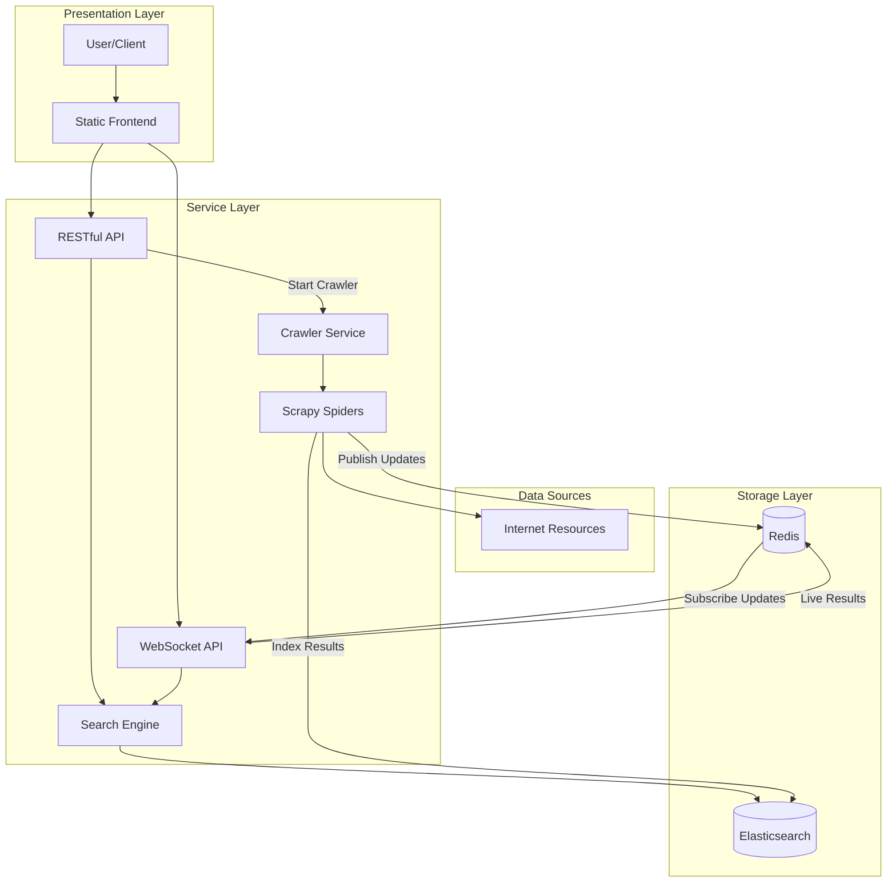

# Resource Grep: Technical Architecture

Resource Grep is a real-time search engine for programming resources that crawls the web to find and index programming-related content. This document explains the technical architecture and components of the system.

## System Overview

Resource Grep consists of several microservices that work together to provide real-time search capabilities for programming resources. The system is built with a focus on scalability, extensibility, and performance.

## Core Components

### 1. Frontend

A static HTML/CSS/JavaScript application that provides a user interface for searching programming resources. The frontend communicates with the API for traditional request-response interactions and with the Streaming API for real-time updates.

**Technologies:**
- HTML5, CSS3, JavaScript
- WebSocket for real-time communication

### 2. API Service

A RESTful API built with FastAPI that handles search requests and crawler management. The API serves as the primary entry point for client applications to interact with the system.

**Technologies:**
- FastAPI (Python)
- RESTful API design

**Endpoints:**
- `/search` - Search for resources
- `/crawler/start` - Start a new crawler job
- `/status` - Get system status

### 3. Streaming API

A WebSocket-based API that provides real-time updates for search results as they are discovered by the crawler. This allows clients to receive instant updates without polling.

**Technologies:**
- FastAPI (Python)
- WebSockets
- Redis Pub/Sub

**Endpoints:**
- `/ws/search` - WebSocket endpoint for live search results

### 4. Search Engine

A component responsible for querying Elasticsearch and returning relevant results based on various criteria, including text matching, relevance scoring, and filtering.

**Technologies:**
- Elasticsearch Python client
- Vector search capabilities
- Relevance scoring algorithms

### 5. Crawler Service

A distributed web crawler that fetches and processes web pages, extracts relevant information, and indexes it in Elasticsearch. The crawler is designed to be scalable and fault-tolerant.

**Components:**
- **Coordinator**: Manages crawler jobs and distributes work
- **Scrapy Spiders**: Process web pages and extract information
- **Resource Pipeline**: Processes and indexes extracted data

**Technologies:**
- Scrapy framework
- Python
- Distributed crawling architecture

### 6. Storage Layer

#### Elasticsearch

The primary data store for indexed resources. Elasticsearch provides powerful search capabilities, including full-text search, faceted search, and relevance scoring.

**Data Model:**
- Resource index with fields for URL, title, description, content, code snippets, etc.
- Relevance scoring based on multiple factors
- Text analysis optimized for programming-related content

#### Redis

A high-performance in-memory data store used for:
- Real-time messaging via Pub/Sub
- Caching frequently accessed data
- Coordinating distributed crawler jobs

## Data Flow

### Search Flow

1. User enters a search query in the frontend
2. The frontend sends a request to the API
3. The API queries the Search Engine
4. The Search Engine retrieves results from Elasticsearch
5. If few or no results are found, the API starts a new crawler job
6. Results are returned to the frontend
7. If the WebSocket connection is active, real-time updates are pushed to the client as new resources are discovered

### Crawling Flow

1. API or Scheduler triggers a new crawler job with a search query
2. Crawler Service initiates Scrapy spiders with the search query
3. Spiders crawl the web, following links and extracting resource information
4. Extracted resources are processed through the pipeline
5. Resources are indexed in Elasticsearch
6. Updates are published to Redis
7. Streaming API receives updates from Redis and pushes them to connected clients

## Crawling Strategy

The crawler employs a sophisticated strategy to discover and index programming resources:

1. **Seed URLs**: Start with curated URLs relevant to the search query
2. **Breadth-First Crawling**: Follow links in a breadth-first manner to discover related content
3. **Content Detection**: Identify pages containing valuable programming resources
4. **Resource Extraction**: Extract structured data from identified pages
5. **Quality Scoring**: Assign quality scores based on multiple factors
6. **Indexing**: Store extracted and scored resources in Elasticsearch

### URL Selection Logic

The crawler uses a sophisticated algorithm to determine which URLs to follow:

1. Always follow URLs containing the search query term
2. Always follow URLs from priority domains (GitHub, Stack Overflow, etc.)
3. Filter out obviously irrelevant content (login pages, etc.)
4. Follow most other URLs to maximize discovery

### Resource Detection

The system identifies valuable programming resources based on several indicators:

1. Presence of code snippets
2. Keywords in title and description
3. Page structure (tutorials, documentation, etc.)
4. Domain reputation
5. Content relevance to the search query

## Scaling Considerations

The architecture is designed to scale horizontally across all components:

1. **Frontend**: Static content can be served through CDN
2. **API/Streaming API**: Can be deployed across multiple instances behind a load balancer
3. **Elasticsearch**: Supports clustering for high availability and capacity
4. **Redis**: Can be configured in cluster mode
5. **Crawler**: Can run multiple instances with coordinated work distribution

## Security Considerations

1. **Rate Limiting**: Protect API endpoints from abuse
2. **Robots.txt Compliance**: Respect website crawling policies
3. **User Agent Identification**: Clearly identify crawler
4. **Data Validation**: Validate and sanitize all inputs
5. **Monitoring**: Monitor for unusual patterns or potential abuse

## Future Enhancements

1. **Embeddings-based Semantic Search**: Use ML models to understand query intent
2. **Adaptive Crawling**: Adjust crawling patterns based on discovered content quality
3. **User Feedback Loop**: Incorporate user feedback to improve search results
4. **Custom Ranking Models**: Allow domain-specific ranking adjustments
5. **Content Classification**: Automatically categorize content by type and technology
6. **Multi-language Support**: Expand beyond English content
7. **Resource Recommendation**: Suggest related resources based on user behavior 