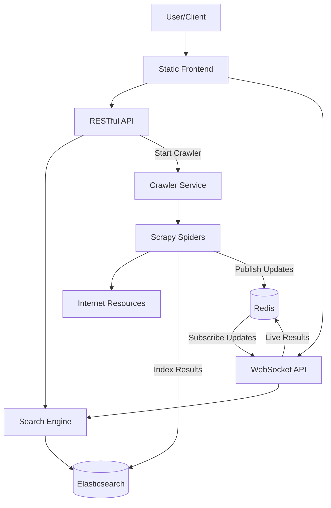

# Resource Grep

Resource Grep is a real-time search engine for programming resources, designed to instantly find relevant developer resources like tutorials, documentation, code snippets, and articles from across the entire internet.

## Features

- **Comprehensive Internet Search** - Searches the entire internet for programming resources without limitations
- **Real-time search** - Instantly find programming resources as you type
- **Live WebSocket updates** - See new resources as they're discovered in real-time
- **Intelligent crawling** - Automatically crawls the web when new search terms are entered
- **Support for all programming languages** - From modern languages like Python and JavaScript to legacy systems like COBOL and FORTRAN
- **Filtering** - Filter results by resource type and programming language
- **Code snippets** - Extract and view relevant code snippets from resources
- **Smart quality scoring** - Resources are scored by relevance and quality

## Architecture

Resource Grep uses a modern microservices architecture with Docker Compose:



### Components

- **Frontend**: Static HTML/JS/CSS served by Nginx with automatic fallback between HTTP and WebSocket modes
- **API**: FastAPI backend for HTTP search queries
- **Streaming API**: WebSocket server for real-time search results
- **Crawler**: Advanced Scrapy-based web crawler with comprehensive internet search capabilities
- **Search Engine**: Elasticsearch-based search with relevance scoring
- **Redis**: Used for messaging and real-time updates
- **Elasticsearch**: Stores and indexes resource data

## How it Works

1. **Search Initiation**: When a user searches for any programming topic:
   - The query is sent to both the HTTP API and WebSocket API
   - The frontend automatically falls back to the most reliable method
   - The API returns immediate results from the current index
   
2. **Unlimited Crawling**: For new or low-result queries:
   - A crawler job is automatically started
   - The crawler searches across the entire internet with minimal restrictions
   - Uses intelligent URL selection to find relevant resources
   - Resources are indexed in real-time
   
3. **Live Results**: As the crawler discovers new resources:
   - They are immediately indexed in Elasticsearch
   - Updates are pushed to connected clients via WebSockets
   - Users see new results appear without refreshing

4. **Smart Resource Processing**:
   - Resources are analyzed for code snippets, relevance, and quality
   - Content is classified by type (tutorial, documentation, article, etc.)
   - Resources are scored for relevance to the query
   - Special handling for legacy programming languages

## Getting Started

### Prerequisites

- Docker and Docker Compose

### Running the Project

1. Clone the repository:
   ```
   git clone https://github.com/username/resource-grep.git
   cd resource-grep
   ```

2. Start the services:
   ```
   docker-compose up -d
   ```

3. Access the frontend:
   ```
   http://localhost:3000
   ```

### Search Endpoints

#### HTTP Search API
```
GET http://localhost:8000/search?q=SEARCH_TERM
```

#### WebSocket API (for live updates)
```
ws://localhost:8001/ws/search?query=SEARCH_TERM
```

## Advanced Features

### Intelligent Crawling

The crawler employs sophisticated strategies to find the most relevant resources:

1. **Unrestricted Internet Search**: Capable of searching the entire internet without artificial limitations
   - Disabled robots.txt restrictions for comprehensive crawling
   - Increased concurrent requests and reduced delay for faster crawling
   - Increased depth limit and timeout for more thorough exploration
   - Special handling for search engines like Google, Bing, DuckDuckGo, and more

2. **Priority Domains**: Focuses on quality programming resources from sites like:
   - GitHub, Stack Overflow, Medium, Dev.to
   - Official documentation sites
   - Educational platforms
   - Legacy programming resources
   - Academic and research sites
   
3. **Smart URL Selection**: Dynamically decides which links to follow based on:
   - Relevance to the search query
   - Domain reputation
   - Content quality indicators
   - Programming-related path components
   
4. **Resource Detection**: Uses multiple signals to identify valuable content:
   - Presence of code snippets
   - Technical keyword density
   - Page structure analysis
   - Domain authority
   - Special handling for legacy programming languages

### Comprehensive Resource Types

Resource Grep indexes a wide variety of programming resources:

- **Tutorials and guides**
- **Official documentation**
- **Code repositories**
- **Blog articles**
- **Forum discussions**
- **Video tutorials** (metadata)
- **Educational courses**
- **Reference materials**
- **Legacy programming resources**
- **Academic papers and research**

## Technical Documentation

For detailed technical information about the system architecture, components, and implementation details, see the [ARCHITECTURE.md](ARCHITECTURE.md) file.

## Project Status

This project is actively developed. The system currently crawls resources for all programming languages and technologies, with special handling for both modern and legacy languages.

## License

This project is licensed under the MIT License - see the LICENSE file for details.